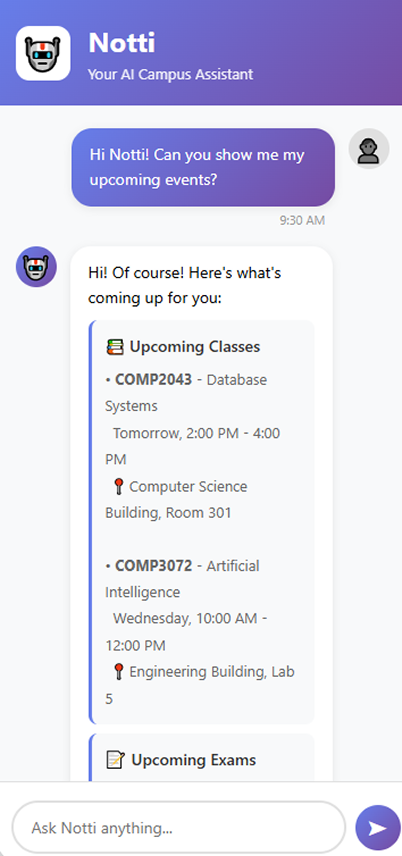

# My Nottingham - Campus Life Hub

> An Enhanced Campus Services Platform for University of Nottingham Malaysia

**Course:** COMP3040 Mobile Device Programming  
**Coursework:** Requirements and Analysis  
**Team:** Group B  
**Members:** Junru Wang, Hao Pan, Wenjun Xia  
**Date:** October 2025

📱 **[View Figma Prototype](https://www.figma.com/design/6ougQIvpDwv5uiHiL3XPF0/My-Nottingham)**

---

## 📋 Table of Contents

- [🎯 Problem Statement and Motivation](#-problem-statement-and-motivation)
- [💡 Potential Impact and Challenges](#-potential-impact-and-challenges)
- [🚀 Use Cases and User Stories](#-use-cases-and-user-stories)

---

## 🎯 Problem Statement and Motivation

### The Problem

The University of Nottingham Malaysia currently uses **Instatt** for basic class attendance check-in. While functional for its intended purpose, the university lacks a comprehensive platform that integrates other essential campus services. Students face severe fragmentation when accessing daily necessities:

*My Nottingham - Home Screen showing integrated services*

#### Current Pain Points:

- **Multiple platforms**: Students juggle separate systems for shuttle booking, food ordering, facility reservations, and communication
- **Time waste**: 15-20 minutes daily switching between different apps and websites
- **Missed opportunities**: Important announcements, booking slots, and shuttle timings often missed
- **Poor user experience**: Each system requires different credentials and has inconsistent interfaces
- **No intelligent assistance**: Students must manually search for information across platforms

### Proposed Solution

We propose developing **Campus Life Hub (My Nottingham)**, a comprehensive mobile platform that integrates all essential campus services into one unified application. The platform will maintain Instatt's existing attendance functionality while adding:

1. **Shuttle Timeline**: Provide bus schedules for different time periods
2. **Campus Cafeteria Delivery**: Food ordering with delivery tracking
3. **Sports Facility Booking**: Seamless reservation system with guidelines
4. **AI Assistant "Notti"**: Intelligent chatbot for campus queries
5. **Campus Community**: Built-in messaging and forum
6. **Student Errand Marketplace**: Peer-to-peer delivery service

### Why a Unified Mobile Platform?

1. **Single Authentication**: One login for all services, leveraging university credentials
2. **Unified Notifications**: Consolidated alerts for bookings, events, and announcements
3. **Consistent Experience**: Familiar interface reduces learning curve
4. **Accessibility**: Students carry smartphones everywhere

### Innovative Features

Our platform differentiates itself through:

1. **AI-Powered Assistant**: Notti provides conversational answers about schedules, bookings, and campus events using natural language processing
2. **Real-Time Everything**: Live shuttle tracking, instant booking confirmations, real-time chat and order status
3. **Smart Scheduling**: Automatic conflict detection between classes, bookings, and events
4. **Community-Driven**: Student-to-student errand marketplace fosters peer economy
5. **Comprehensive Integration**: First platform to unify transportation, dining, sports, academics, and social features

---

## 💡 Potential Impact and Challenges

### Potential Impact

#### For Students:
- **Time savings**: 10-15 hours per semester through streamlined processes
- **Reduced stress**: No more missed shuttles, forgotten bookings, or lost announcements
- **Enhanced community**: Integrated social features foster campus connections
- **Better organization**: All campus activities centralized in one app

#### For University:
- **Operational efficiency**: 40% reduction in administrative phone inquiries
- **Data-driven decisions**: Analytics on facility usage, shuttle demand, and peak times
- **Environmental benefits**: Paperless booking and payment systems
- **Cost savings**: Reduced administrative overhead across departments
- **Student satisfaction**: Improved campus experience attracts and retains students

#### Social Impact:
- **Sustainability**: Optimized shuttle routes reduce carbon emissions
- **Peer economy**: Errand marketplace provides income opportunities for students

### Key Challenges and Solutions

#### 🔄 Update Data
**Challenge:** Keeping information from different campus services (like buses, cafeteria, and facilities) updated and consistent for students.

**Solution:** Assign each department a staff representative to update their section regularly, ensuring students always see accurate and current information.

#### 👥 User Adoption
**Challenge:** Students resistant to changing from current workflow and learning new system

**Solution:** Phased rollout starting with high-value features (booking, food ordering). Provide incentives for early adopters (free delivery credits). Include comprehensive in-app tutorials.

#### ⚡ Scalability
**Challenge:** Handling 3,000+ concurrent food delivery orders during peak lunch hours

**Solution:** Use online servers to handle more orders at once. Improve delivery speed by storing common data for quick access and processing orders step by step to avoid delays.

#### 🔒 Data Privacy & Security
**Challenge:** Protecting sensitive student information and payment details

**Solution:** Use secure communication, follow data protection rules, protect payments, and add login verification for safety.

## 🚀 Use Cases and User Stories

### Must-Have Features

#### UC1: Campus Shuttle Timeline

  
  
  
<i>Shuttle Timeline showing Routes A–G and Detailed Timeline</i>

**User Story 1.1**

> **As a** student  
> **I want to** view all shuttle routes and their schedules  
> **So that** I can plan my journey to/from campus

**Acceptance Criteria:**
- Display all routes (A, B, C, D, G) with visual map
- Show departure and return times for each route
- Indicate pickup and destination locations
- Color-coded availability status

---

#### UC2: Cafeteria Food Ordering

  
  
  
<i>Cafeteria ordering system and food menu</i>

**User Story 2.1**

> **As a** student  
> **I want to** browse the cafeteria menu and order food for delivery  
> **So that** I can skip long queues

**Acceptance Criteria:**
- Browse menu by cuisine type with photos and prices
- Add items to cart with customizable quantity
- View total price including delivery fee
- Choose delivery location (e.g., dormitory or campus area)
- Payment via integrated e-wallet

---

#### UC3: Sports Facility Booking

  
  

  
  
  
<i>Sports facility booking system and management</i>

**User Story 3.1**

> **As a** student  
> **I want to** check availability of sports facilities  
> **So that** I can book for my preferred time

**Acceptance Criteria:**
- Select facility type (3G Pitch, Badminton Courts 1-2, Tennis Courts 1-2, Sports Hall Courts 1-2, Squash Courts 1-2, Outdoor Courts 1-4, Fields 1-3)
- View calendar showing available and booked time slots
- Display booking guidelines (minimum players, duration limits, equipment rental rates)
- Show equipment availability (balls, rackets, etc.)

**User Story 3.2**

> **As a** student  
> **I want to** view and manage my facility bookings  
> **So that** I can cancel if plans change

**Acceptance Criteria:**
- List all upcoming bookings with date, time, and facility details
- View past bookings history
- Cancel booking option (up to 2 hours before start time)
- Add booking to device calendar automatically
- View facility-specific rules and guidelines

---

#### UC4: AI Assistant (Notti)

  
  
<i>Notti AI assistant providing information about upcoming events and exams</i>

**User Story 4.1**

> **As a** student  
> **I want to** ask Notti questions about campus services  
> **So that** I get instant answers without searching multiple sources

**Acceptance Criteria:**
- Natural language query processing (e.g., "When is my next class?", "What shuttles go to city center?")
- Provide accurate information on: class schedules, exams, campus events, facility bookings, shuttle times, cafeteria menus
- Conversation history saved for context

**User Story 4.2**

> **As a** student  
> **I want** Notti to proactively remind me of important events  
> **So that** I don't miss deadlines or appointments

**Acceptance Criteria:**
- Automatic reminders for: upcoming exams (3 days before), assignment deadlines (1 day before), facility bookings (1 hour before), shuttle departures (15 minutes before), library book due dates
- Customizable reminder preferences (timing and frequency)
- Smart scheduling: detect conflicts between bookings and classes

**User Story 4.3**

> **As a** student  
> **I want to** upload documents to Notti for analysis  
> **So that** I can get help understanding academic materials

**Acceptance Criteria:**
- Support file formats: PDF, DOCX, images (JPG, PNG)
- Extract text from uploaded documents
- Provide summaries of long documents
- Answer questions about uploaded content
- Explain complex concepts in simpler terms
