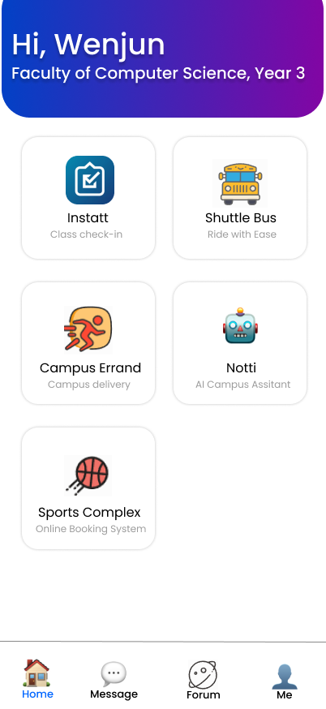

# My Nottingham - Campus Life Hub

> An Enhanced Campus Services Platform for University of Nottingham Malaysia

**Course:** COMP3040 Mobile Device Programming  
**Coursework:** Requirements and Analysis  
**Team:** Group B  
**Members:** Junru Wang, Hao Pan, Wenjun Xia  
**Date:** October 2025

📱 **[View Figma Prototype](https://www.figma.com/design/6ougQIvpDwv5uiHiL3XPF0/My-Nottingham)**

---

## 📋 Table of Contents

- [🎯 Problem Statement and Motivation](#-problem-statement-and-motivation)
- [💡 Potential Impact and Challenges](#-potential-impact-and-challenges)

---

## 🎯 Problem Statement and Motivation

### The Problem

The University of Nottingham Malaysia currently uses **Instatt** for basic class attendance check-in. While functional for its intended purpose, the university lacks a comprehensive platform that integrates other essential campus services. Students face severe fragmentation when accessing daily necessities:

*My Nottingham - Home Screen showing integrated services*

#### Current Pain Points:

- **Multiple platforms**: Students juggle separate systems for shuttle booking, food ordering, facility reservations, and communication
- **Time waste**: 15-20 minutes daily switching between different apps and websites
- **Missed opportunities**: Important announcements, booking slots, and shuttle timings often missed
- **Poor user experience**: Each system requires different credentials and has inconsistent interfaces
- **No intelligent assistance**: Students must manually search for information across platforms

### Proposed Solution

We propose developing **Campus Life Hub (My Nottingham)**, a comprehensive mobile platform that integrates all essential campus services into one unified application. The platform will maintain Instatt's existing attendance functionality while adding:

1. **Shuttle Time Line**: Provide bus schedules for different time periods
2. **Campus Cafeteria Delivery**: Food ordering with delivery tracking
3. **Sports Facility Booking**: Seamless reservation system with guidelines
4. **AI Assistant "Notti"**: Intelligent chatbot for campus queries
5. **Campus Community**: Built-in messaging and forum
6. **Student Errand Marketplace**: Peer-to-peer delivery service

### Why a Unified Mobile Platform?

1. **Single Authentication**: One login for all services, leveraging university credentials
2. **Unified Notifications**: Consolidated alerts for bookings, events, and announcements
3. **Consistent Experience**: Familiar interface reduces learning curve
4. **Accessibility**: Students carry smartphones everywhere

### Innovative Features

Our platform differentiates itself through:

1. **AI-Powered Assistant**: Notti provides conversational answers about schedules, bookings, and campus events using natural language processing
2. **Real-Time Everything**: Live shuttle tracking, instant booking confirmations, real-time chat and order status
3. **Smart Scheduling**: Automatic conflict detection between classes, bookings, and events
4. **Community-Driven**: Student-to-student errand marketplace fosters peer economy
5. **Comprehensive Integration**: First platform to unify transportation, dining, sports, academics, and social features

---

## 💡 Potential Impact and Challenges

### Potential Impact

#### For Students:
- **Time savings**: 10-15 hours per semester through streamlined processes
- **Reduced stress**: No more missed shuttles, forgotten bookings, or lost announcements
- **Enhanced community**: Integrated social features foster campus connections
- **Better organization**: All campus activities centralized in one app

#### For University:
- **Operational efficiency**: 40% reduction in administrative phone inquiries
- **Data-driven decisions**: Analytics on facility usage, shuttle demand, and peak times
- **Environmental benefits**: Paperless booking and payment systems
- **Cost savings**: Reduced administrative overhead across departments
- **Student satisfaction**: Improved campus experience attracts and retains students

#### Social Impact:
- **Sustainability**: Optimized shuttle routes reduce carbon emissions
- **Peer economy**: Errand marketplace provides income opportunities for students

### Key Challenges and Solutions

#### 🔄 Update Data
**Challenge:** Keeping information from different campus services (like buses, cafeteria, and facilities) updated and consistent for students.

**Solution:** Assign each department a staff representative to update their section regularly, ensuring students always see accurate and current information.

#### 👥 User Adoption
**Challenge:** Students resistant to changing from current workflow and learning new system

**Solution:** Phased rollout starting with high-value features (booking, food ordering). Provide incentives for early adopters (free delivery credits). Include comprehensive in-app tutorials.

#### ⚡ Scalability
**Challenge:** Handling 3,000+ concurrent food delivery orders during peak lunch hours

**Solution:** Use online servers to handle more orders at once. Improve delivery speed by storing common data for quick access and processing orders step by step to avoid delays.

#### 🔒 Data Privacy & Security
**Challenge:** Protecting sensitive student information and payment details

**Solution:** Use secure communication, follow data protection rules, protect payments, and add login verification for safety.
---