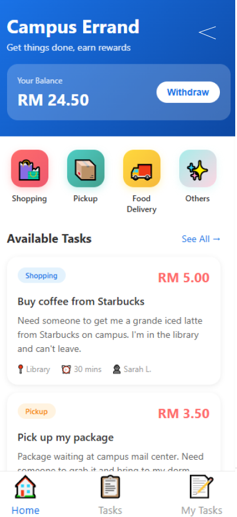
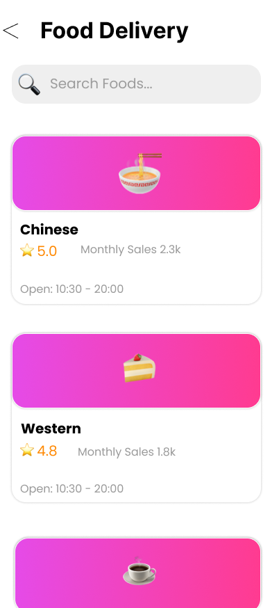
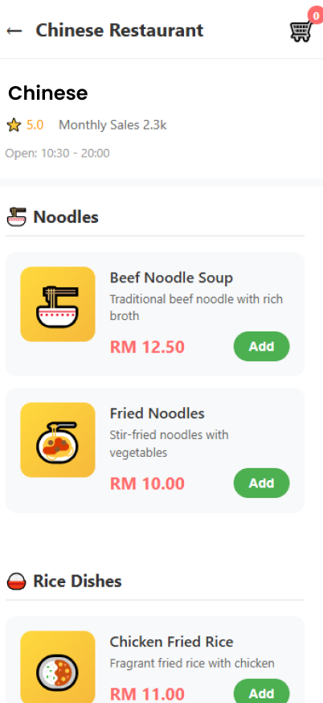
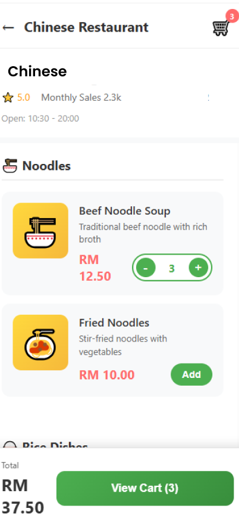
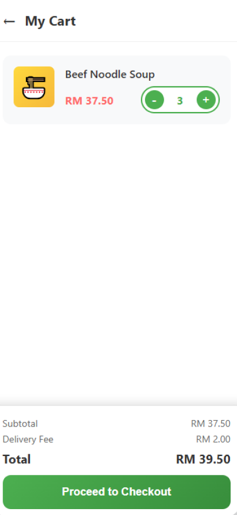

# My Nottingham  
### An Enhanced Campus Services Platform  

**COMP3040 Mobile Device Programming**  
Coursework 1: Requirements and Analysis  

**Group B**  
- Junru Wang  
- Hao Pan  
- Wenjun Xia  

Faculty of Computer Science, Year 3  
University of Nottingham Malaysia  

**Date:** October 2025  

---

### Figma Prototype  
📱 **[View Figma Prototype](https://www.figma.com/design/6ougQIvpDwv5uiHiL3XPF0/My-Nottingham)**

---

## 📋 Table of Contents
- [🎯 Problem Statement and Motivation](#-problem-statement-and-motivation)
- [💡 Potential Impact and Challenges](#-potential-impact-and-challenges)
- [🚀 Use Cases and User Stories](#-use-cases-and-user-stories)

---

## 🎯 Problem Statement and Motivation

### The Problem

The University of Nottingham Malaysia currently uses **Instatt** for basic class attendance check-in.  
While functional for its intended purpose, the university lacks a comprehensive platform that integrates other essential campus services.  
Students face severe fragmentation when accessing daily necessities:

*My Nottingham - Home Screen showing integrated services*

**Current pain points:**
- **Multiple platforms:** Students juggle separate systems for shuttle booking, food ordering, facility reservations, and communication
- **Time waste:** 15–20 minutes daily switching between different apps and websites
- **Missed opportunities:** Important announcements, booking slots, and shuttle timings often missed
- **Poor user experience:** Each system requires different credentials and has inconsistent interfaces
- **No intelligent assistance:** Students must manually search for information across platforms

---

### Proposed Solution

We propose developing **Campus Life Hub (My Nottingham)**, a comprehensive mobile platform that integrates all essential campus services into one unified application.  
The platform will maintain Instatt's existing attendance functionality while adding:

1. **Shuttle Time Line:** Provide bus schedules for different time periods  
2. **Sports Facility Booking:** Seamless reservation system with guidelines  
3. **AI Assistant "Notti":** Intelligent chatbot for campus queries  
4. **Campus Community:** Built-in messaging and forum  
5. **Student Errand Marketplace:** Peer-to-peer delivery service  

---

### Why a Unified Mobile Platform?

1. **Single Authentication:** One login for all services, leveraging university credentials  
2. **Unified Notifications:** Consolidated alerts for bookings, events, and announcements  
3. **Consistent Experience:** Familiar interface reduces learning curve  
4. **Accessibility:** Students carry smartphones everywhere  

---

### Innovative Features

- **AI-Powered Assistant:** Notti provides conversational answers about schedules, bookings, and campus events using NLP  
- **Real-Time Everything:** Instant booking confirmations, chat, and order status  
- **Smart Scheduling:** Automatic conflict detection between classes, bookings, and events  
- **Community-Driven:** Student-to-student errand marketplace fosters peer economy  
- **Comprehensive Integration:** Unifies transportation, dining, sports, academics, and social features  

---

## 💡 Potential Impact and Challenges

### Potential Impact

**For Students:**
- Time savings: 10–15 hours per semester through streamlined processes  
- Reduced stress: No more missed shuttles or forgotten bookings  
- Enhanced community: Integrated social features foster campus connections  
- Better organization: All campus activities centralized in one app  

**For University:**
- Operational efficiency: 40% reduction in administrative inquiries  
- Data-driven decisions: Analytics on facility and shuttle usage  
- Environmental benefits: Paperless booking and payments  
- Cost savings: Reduced administrative overhead  
- Student satisfaction: Improved campus experience  

**Social Impact:**
- Sustainability: Optimized shuttle routes reduce emissions  
- Peer economy: Student errand marketplace provides income opportunities  

---

### Key Challenges and Solutions

#### 🔄 Update Data
**Challenge:** Keeping information from different campus services updated  
**Solution:** Assign staff from each department to maintain accurate data regularly.

#### 👥 User Adoption
**Challenge:** Students may resist learning a new system  
**Solution:** Phased rollout + incentives for early adopters (e.g., free credits) + in-app tutorials.

#### ⚡ Scalability
**Challenge:** Handling 3,000+ concurrent orders during peak hours  
**Solution:** Use online servers, cache frequently used data, process tasks asynchronously.

#### 🔒 Data Privacy & Security
**Challenge:** Protecting student and payment data  
**Solution:** Encrypted communications, secure login, compliance with PDPA, verified payments.

---

## 🚀 Use Cases and User Stories

### Must-Have Features

---

### UC1: Campus Shuttle Time Line

  
  
  
<i>Shuttle Timeline showing Routes A–G and Detailed Timeline</i>

#### **User Story 1.1**
> **As a** student, **I want to** view all shuttle routes and schedules **so that** I can plan my journey.  

**Acceptance Criteria:**
- Display routes (A–G) with map  
- Show departure/return times  
- Indicate pickup/destination points  
- Color-coded availability  

---

### UC2: Campus Errand Service

  
  
  
<i>Campus Errand: Marketplace and Task Creation</i>

  
  
  
<i>All Available and Posted Tasks</i>

  
  
  
<i>Accepted Tasks and Detailed Task Information</i>

  
  
<i>Additional Notes or Instructions</i>

#### **User Story 2.1 - Campus Errand Requester**
> **As a** student, **I want to** request delivery services **so that** I can get items within campus.

**Acceptance Criteria:**
- Describe item and attach photo  
- Set pickup/dropoff locations  
- Choose urgency: Standard or Express  
- View estimated delivery time and fee  
- Rate and tip after completion  

#### **User Story 2.2 - Campus Errand Provider**
> **As a** student, **I want to** accept errands **so that** I can earn extra income.

**Acceptance Criteria:**
- View available tasks  
- Accept suitable errands  
- Mark tasks as picked/completed  
- Receive payment via e-wallet  
- View earnings history  

#### **User Story 2.3 - Cafeteria Food Ordering**
> **As a** student, **I want to** browse the cafeteria menu and order food **so that** I can skip queues.

**Acceptance Criteria:**
- Browse menu with photos  
- Add to cart, view total price  
- Choose delivery location  
- Pay via e-wallet  

  
  
  
<i>Cafeteria Ordering System and Menu Browsing</i>

  
  
  
<i>Order Customization and Cart Confirmation</i>

---

### UC3: Sports Facility Booking

  
  
  
<i>Sports Facility Selection and Type Overview</i>

  
  
  
<i>Booking Time Slots and Management of Reservations</i>

#### **User Story 3.1**
> **As a** student, **I want to** check facility availability **so that** I can book at my preferred time.

**Acceptance Criteria:**
- Select facility type  
- View available slots  
- Display guidelines and equipment info  

#### **User Story 3.2**
> **As a** student, **I want to** manage my bookings **so that** I can cancel if plans change.

**Acceptance Criteria:**
- List all upcoming bookings  
- Cancel up to 2 hours before  
- Sync with calendar  
- Show facility rules  

---

### UC4: AI Assistant (Notti)

#### **User Story 4.1**
> **As a** student, **I want to** ask Notti questions **so that** I get instant answers.

**Acceptance Criteria:**
- Natural language queries  
- Info on schedules, events, bookings, menus  
- Save conversation history  

#### **User Story 4.2**
> **As a** student, **I want** Notti to remind me of events **so that** I don’t miss deadlines.

**Acceptance Criteria:**
- Auto reminders for exams, assignments, shuttles, etc.  
- Customizable preferences  
- Conflict detection between bookings and classes  

---

### UC5: Campus Messaging and Forum

  
  
  
<i>Messaging Interface and Conversation Details</i>

  
  
  
<i>Forum with Categorized and Detailed Posts</i>

  
  
<i>Additional Forum View</i>

#### **User Story 5.1**
> **As a** student, **I want to** message classmates **so that** I can collaborate easily.

**Acceptance Criteria:**
- Search by name or ID  
- Send text, images, files  
- Group chats  
- Pin conversations  
- Real-time messaging + notifications  

#### **User Story 5.2**
> **As a** student, **I want to** use forums **so that** I can share knowledge and stay informed.

**Acceptance Criteria:**
- Browse posts by category  
- Create and comment  
- Like or report posts  
- Search by keyword  

#### **User Story 5.3**
> **As a** student, **I want to** receive official announcements **so that** I stay informed.

**Acceptance Criteria:**
- Dedicated announcement section  
- Push notifications for urgent news  
- Categorized by department  
- Archive and acknowledgment options  

---

### UC6: User Profile Management

#### **User Story 6.1**
> **As a** student, **I want to** view and update my profile **so that** my details stay current.

**Acceptance Criteria:**
- Display student info (name, email, ID, etc.)  
- Change profile picture  
- View academic data  
- Manage notification settings  
- Switch between delivery/normal mode  
- Secure logout  

#### **User Story 6.2**
> **As a** student, **I want to** control notifications and availability **so that** I can manage tasks.

**Acceptance Criteria:**
- Toggle errand notifications  
- Activate/deactivate delivery mode  
- Visual status indicator  
- Instant feedback message  

---

### Nice-to-Have Features

#### UC7: Integrated Payment System
- **Feature:** Cashless payments via saved cards/e-wallets  
- **Benefit:** Faster, more secure transactions  

#### UC8: Event Discovery and RSVP
- **Feature:** Browse events, RSVP, auto add to calendar  
- **Benefit:** Boosts participation and planning  

#### UC9: Study Room Booking
- **Feature:** Reserve study rooms by capacity with real-time availability  
- **Benefit:** Reduces waiting, better space use  

#### UC10: Lost and Found
- **Feature:** Report/search lost items, receive notifications  
- **Benefit:** Helps recover belongings efficiently  

---

## Existing Solutions Review

### Campus-Specific Apps

**UM Touch (University of Malaya)**
- Similarity: Shuttle Timeline  
- Difference: No food/community features  
- Advantage: Modern, all-in-one integration  

### Generic Solutions

**Blackboard / Moodle Mobile**
- Academic only  
- No service or community features  
- Our advantage: Covers entire campus life  

**GrabFood / Foodpanda**
- Commercial, high fees, no campus integration  
- Our advantage: Campus-only delivery with student participation  

**WhatsApp / Telegram**
- General messaging only  
- No verification or forums  
- Our advantage: Verified student community with categories and announcements  

### Fundamental Differences

Campus Life Hub is unique because it:
1. Integrates all campus services  
2. Includes AI-powered assistant  
3. Offers real-time updates  
4. Enables peer-to-peer marketplace  
5. Officially partners with university  
6. Designed specifically for students  

---

## Assumptions

### Regulatory Assumptions
1. Complies with PDPA 2010  
2. Supports payment gateways (iPay88, Senangpay)  
3. Forum follows university and local communication rules  
4. Peer-to-peer service terms clearly stated  
5. University approval for using student info  

### Operational Assumptions
1. Campus units provide regular updates  
2. Basic support via email/in-app  
3. Gradual rollout via pilot group  
4. Offline access for schedules/bookings  
5. Minimal essential notifications  
6. Forum moderated by staff/students  

---
