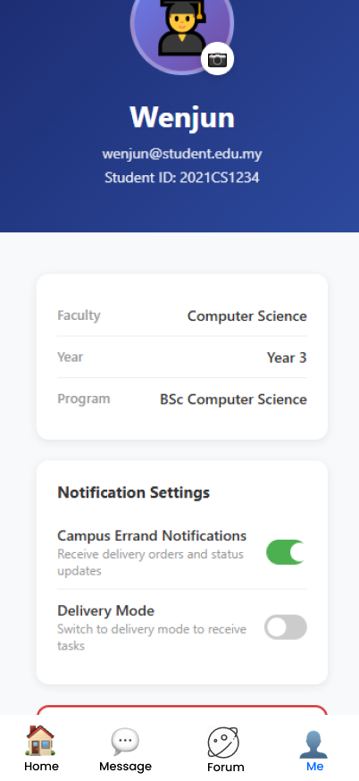

# My Nottingham - Campus Life Hub

> An Enhanced Campus Services Platform for University of Nottingham Malaysia

**Course:** COMP3040 Mobile Device Programming  
**Coursework:** Requirements and Analysis  
**Team:** Group B  
**Members:** Junru Wang, Hao Pan, Wenjun Xia  
**Date:** October 2025

📱 **[View Figma Prototype](https://www.figma.com/design/6ougQIvpDwv5uiHiL3XPF0/My-Nottingham)**

---

## 📋 Table of Contents

- [🎯 Problem Statement and Motivation](#-problem-statement-and-motivation)
- [💡 Potential Impact and Challenges](#-potential-impact-and-challenges)
- [🚀 Use Cases and User Stories](#-use-cases-and-user-stories)

---

## 🎯 Problem Statement and Motivation

### The Problem

The University of Nottingham Malaysia currently uses **Instatt** for basic class attendance check-in. While functional for its intended purpose, the university lacks a comprehensive platform that integrates other essential campus services. Students face severe fragmentation when accessing daily necessities:

*My Nottingham - Home Screen showing integrated services*

#### Current Pain Points:

- **Multiple platforms**: Students juggle separate systems for shuttle booking, food ordering, facility reservations, and communication
- **Time waste**: 15-20 minutes daily switching between different apps and websites
- **Missed opportunities**: Important announcements, booking slots, and shuttle timings often missed
- **Poor user experience**: Each system requires different credentials and has inconsistent interfaces
- **No intelligent assistance**: Students must manually search for information across platforms

### Proposed Solution

We propose developing **Campus Life Hub (My Nottingham)**, a comprehensive mobile platform that integrates all essential campus services into one unified application. The platform will maintain Instatt's existing attendance functionality while adding:

1. **Shuttle Timeline**: Provide bus schedules for different time periods
1. **Shuttle Time Line**: Provide bus schedules for different time periods
2. **Campus Cafeteria Delivery**: Food ordering with delivery tracking
3. **Sports Facility Booking**: Seamless reservation system with guidelines
4. **AI Assistant "Notti"**: Intelligent chatbot for campus queries
5. **Campus Community**: Built-in messaging and forum
6. **Student Errand Marketplace**: Peer-to-peer delivery service

### Why a Unified Mobile Platform?

1. **Single Authentication**: One login for all services, leveraging university credentials
2. **Unified Notifications**: Consolidated alerts for bookings, events, and announcements
3. **Consistent Experience**: Familiar interface reduces learning curve
4. **Accessibility**: Students carry smartphones everywhere

### Innovative Features

Our platform differentiates itself through:

1. **AI-Powered Assistant**: Notti provides conversational answers about schedules, bookings, and campus events using natural language processing
2. **Real-Time Everything**: Live shuttle tracking, instant booking confirmations, real-time chat and order status
3. **Smart Scheduling**: Automatic conflict detection between classes, bookings, and events
4. **Community-Driven**: Student-to-student errand marketplace fosters peer economy
5. **Comprehensive Integration**: First platform to unify transportation, dining, sports, academics, and social features

---

## 💡 Potential Impact and Challenges

### Potential Impact

#### For Students:
- **Time savings**: 10-15 hours per semester through streamlined processes
- **Reduced stress**: No more missed shuttles, forgotten bookings, or lost announcements
- **Enhanced community**: Integrated social features foster campus connections
- **Better organization**: All campus activities centralized in one app

#### For University:
- **Operational efficiency**: 40% reduction in administrative phone inquiries
- **Data-driven decisions**: Analytics on facility usage, shuttle demand, and peak times
- **Environmental benefits**: Paperless booking and payment systems
- **Cost savings**: Reduced administrative overhead across departments
- **Student satisfaction**: Improved campus experience attracts and retains students

#### Social Impact:
- **Sustainability**: Optimized shuttle routes reduce carbon emissions
- **Peer economy**: Errand marketplace provides income opportunities for students

### Key Challenges and Solutions

#### 🔄 Update Data
**Challenge:** Keeping information from different campus services (like buses, cafeteria, and facilities) updated and consistent for students.

**Solution:** Assign each department a staff representative to update their section regularly, ensuring students always see accurate and current information.

#### 👥 User Adoption
**Challenge:** Students resistant to changing from current workflow and learning new system

**Solution:** Phased rollout starting with high-value features (booking, food ordering). Provide incentives for early adopters (free delivery credits). Include comprehensive in-app tutorials.

#### ⚡ Scalability
**Challenge:** Handling 3,000+ concurrent food delivery orders during peak lunch hours

**Solution:** Use online servers to handle more orders at once. Improve delivery speed by storing common data for quick access and processing orders step by step to avoid delays.

#### 🔒 Data Privacy & Security
**Challenge:** Protecting sensitive student information and payment details

**Solution:** Use secure communication, follow data protection rules, protect payments, and add login verification for safety.

## 🚀 Use Cases and User Stories

### Must-Have Features

#### UC1: Campus Shuttle Timeline

  
  
  
<i>Shuttle Timeline showing Routes A–G and Detailed Timeline</i>

**User Story 1.1**

> **As a** student  
> **I want to** view all shuttle routes and their schedules  
> **So that** I can plan my journey to/from campus

**Acceptance Criteria:**
- Display all routes (A, B, C, D, G) with visual map
- Show departure and return times for each route
- Indicate pickup and destination locations
- Color-coded availability status

---

#### UC2: Cafeteria Food Ordering

  
  
  
<i>Cafeteria ordering system and food menu</i>

**User Story 2.1**

> **As a** student  
> **I want to** browse the cafeteria menu and order food for delivery  
> **So that** I can skip long queues

**Acceptance Criteria:**
- Browse menu by cuisine type with photos and prices
- Add items to cart with customizable quantity
- View total price including delivery fee
- Choose delivery location (e.g., dormitory or campus area)
- Payment via integrated e-wallet

---

#### UC3: Sports Facility Booking

  
  

  
  
  
<i>Sports facility booking system and management</i>

**User Story 3.1**

> **As a** student  
> **I want to** check availability of sports facilities  
> **So that** I can book for my preferred time

**Acceptance Criteria:**
- Select facility type (3G Pitch, Badminton Courts 1-2, Tennis Courts 1-2, Sports Hall Courts 1-2, Squash Courts 1-2, Outdoor Courts 1-4, Fields 1-3)
- View calendar showing available and booked time slots
- Display booking guidelines (minimum players, duration limits, equipment rental rates)
- Show equipment availability (balls, rackets, etc.)

**User Story 3.2**

> **As a** student  
> **I want to** view and manage my facility bookings  
> **So that** I can cancel if plans change

**Acceptance Criteria:**
- List all upcoming bookings with date, time, and facility details
- View past bookings history
- Cancel booking option (up to 2 hours before start time)
- Add booking to device calendar automatically
- View facility-specific rules and guidelines

---

#### UC4: AI Assistant (Notti)

  
  
<i>Notti AI assistant providing information about upcoming events and exams</i>

**User Story 4.1**

> **As a** student  
> **I want to** ask Notti questions about campus services  
> **So that** I get instant answers without searching multiple sources

**Acceptance Criteria:**
- Natural language query processing (e.g., "When is my next class?", "What shuttles go to city center?")
- Provide accurate information on: class schedules, exams, campus events, facility bookings, shuttle times, cafeteria menus
- Conversation history saved for context

**User Story 4.2**

> **As a** student  
> **I want** Notti to proactively remind me of important events  
> **So that** I don't miss deadlines or appointments

**Acceptance Criteria:**
- Automatic reminders for: upcoming exams (3 days before), assignment deadlines (1 day before), facility bookings (1 hour before), shuttle departures (15 minutes before), library book due dates
- Customizable reminder preferences (timing and frequency)
- Smart scheduling: detect conflicts between bookings and classes

**User Story 4.3**

> **As a** student  
> **I want to** upload documents to Notti for analysis  
> **So that** I can get help understanding academic materials

**Acceptance Criteria:**
- Support file formats: PDF, DOCX, images (JPG, PNG)
- Extract text from uploaded documents
- Provide summaries of long documents
- Answer questions about uploaded content
- Explain complex concepts in simpler terms

#### UC5: Campus Messaging and Forum

  
  
  
<i>Message interface and chat conversations</i>

  
  

  
  
<i>Campus forum with categorized posts and discussions</i>

**User Story 5.1**

> **As a** student  
> **I want to** message my classmates directly  
> **So that** I can collaborate on projects and stay connected

**Acceptance Criteria:**
- Search for students by name or student ID
- Send text messages, images, and file attachments
- Create group chats for project teams or study groups
- Pin important conversations to top
- Real-time message delivery with read receipts
- Push notifications for new messages

**User Story 5.2**

> **As a** student  
> **I want to** participate in campus forums  
> **So that** I can ask questions, share knowledge, and stay informed

**Acceptance Criteria:**
- Browse posts by category: Study, Events, Career, Questions, General, Food
- Create new posts with title, rich text content, and media attachments
- Comment on posts and participate in discussions
- Like posts for later reference
- Report inappropriate content to moderators
- Search posts by keywords or tags

**User Story 5.3**

> **As a** student  
> **I want to** receive official announcements from university  
> **So that** I stay informed about important updates

**Acceptance Criteria:**
- Official announcements displayed in dedicated section with special badge
- Push notifications for urgent announcements (exam schedule changes, facility closures, emergency alerts)
- Categorized by department: Academic Office, Sports Complex, Library, IT Services, Student Affairs
- Archive of past announcements searchable by date or keyword
- Option to acknowledge receipt of important announcements

---

#### UC6: Campus Errand Service

  
  

  
  

  
  

  
  
<i>Campus Errand marketplace for peer-to-peer delivery services</i>

**User Story 6.1**

> **As a** student  
> **I want to** request delivery services from other students  
> **So that** I can get items delivered within campus without leaving my dorm

**Acceptance Criteria:**
- Describe item to be delivered (text description, optional photo)
- Set pickup location (e.g., Library, Sports Complex, Friend's dorm)
- Set dropoff location (own dorm building and room number)
- Choose urgency level: Standard (1-2 hours, RM3-5) or Express (30 min, RM5-10)
- View estimated delivery time and service fee
- Rate and tip service provider after completion

**User Story 6.2**

> **As a** student  
> **I want to** become an errand service provider  
> **So that** I can earn extra money while on campus

**Acceptance Criteria:**
- View list of available errand requests with details and payment
- Accept errands that fit schedule and location
- Navigate to pickup and dropoff locations
- Mark tasks as "Picked up" and "Completed" with photo proof
- Receive payments directly to student account or e-wallet
- View earnings history and ratings from customers

---

#### UC7: User Profile Management

  
  
<i>User profile showing student information</i>

**User Story 7.1**

> **As a** student  
> **I want to** view and update my profile information  
> **So that** my details stay current

**Acceptance Criteria:**
- Display student information: name, email, student ID, faculty, year, program
- Change profile picture by tapping avatar
- View academic information (non-editable, synced from university system)

---

### Nice-to-Have Features

#### UC8: Integrated Payment System
**Feature:** Enable cashless payments for all campus services through saved payment methods (credit/debit card, e-wallet, campus card)

**Benefit:** Eliminates need for cash, reduces transaction time, provides spending analytics

#### UC9: Event Discovery and RSVP
**Feature:** Browse campus events (tech talks, workshops, sports tournaments, cultural festivals) with filtering by category, date, and location. RSVP directly with automatic calendar integration.

**Benefit:** Increases event participation, reduces no-shows, helps organizers plan better

#### UC10: Study Room Booking
**Feature:** Reserve library study rooms with capacity indicators (2-person, 4-person, 8-person), view availability in real-time, receive QR code for room access.

**Benefit:** Eliminates wait times for study rooms, improves library space utilization

#### UC11: Lost and Found
**Feature:** Report lost items with description and photo, search database of found items, receive notifications when matching items are reported, arrange collection from security office.

**Benefit:** Increases chances of recovering lost belongings, reduces burden on security staff

---

## 🔍 Existing Solutions Review

### Campus-Specific Apps

#### UM Touch (University of Malaya)
- **Similarities:** Shuttle Timeline
- **Differences:** No food ordering, no community features
- **Our Advantage:** Modern interface with comprehensive service integration and community building

### Generic Solutions

#### Blackboard / Moodle Mobile
- **Focus:** Academic only (course materials, assignments, grades)
- **Limitation:** No campus services, no booking systems, no community features
- **Our Advantage:** Goes beyond academics to cover entire campus life

#### GrabFood / Foodpanda
- **Focus:** Commercial restaurant delivery
- **Limitation:** High delivery fees (RM5-10), not campus cafeteria, no student marketplace
- **Our Advantage:** Subsidized campus-only service (RM2-3 delivery) with student-to-student errand option

#### WhatsApp / Telegram
- **Focus:** General messaging
- **Limitation:** Not campus-focused, no official channels, no structured forums, no student verification
- **Our Advantage:** Verified student-only community with official announcement channels and categorized forums

### Fundamental Differences

Campus Life Hub is fundamentally different because it:

1. **Holistically integrates ALL campus services** in one unified platform
2. **Provides AI-powered intelligent assistance** through Notti for conversational, context-aware help
3. **Enables real-time features across all services**: booking confirmations, order status, live chat
4. **Fosters peer-to-peer economy** through student errand marketplace, creating income opportunities
5. **Officially partners with university** for seamless integration with existing systems (authentication, payment, timetables)
6. **Student-centric design** built specifically for university workflow with direct student input

---

## 📜 Assumptions

### Regulatory Assumptions

1. The system complies with Malaysia's Personal Data Protection Act (PDPA 2010)
2. Payment gateways such as iPay88 or Senangpay can be integrated for basic transactions
3. Forum content follows university rules and local communication guidelines
4. Peer-to-peer errand terms and responsibilities are stated clearly to users
5. Use of student information is approved by the university's relevant authority

### Operational Assumptions

1. Campus service units (cafeteria, sports, transport) provide updated information regularly
2. Basic support is available during office hours via email or in-app messages
3. User onboarding is gradual — starting with a pilot group before campus-wide release
4. Key features such as viewing schedules or bookings remain accessible offline with later sync
5. Notifications are limited to essential updates to avoid overloading users
6. Forum content is monitored by assigned student moderators or staff members

---

**[⬆ Back to Top](#my-nottingham---campus-life-hub)**
